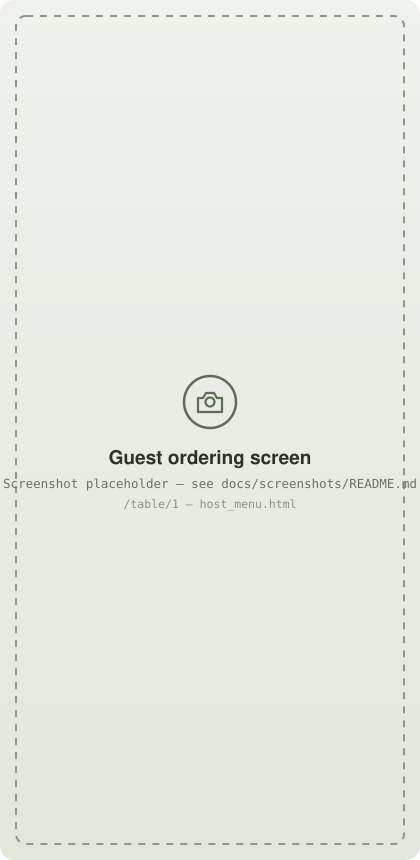
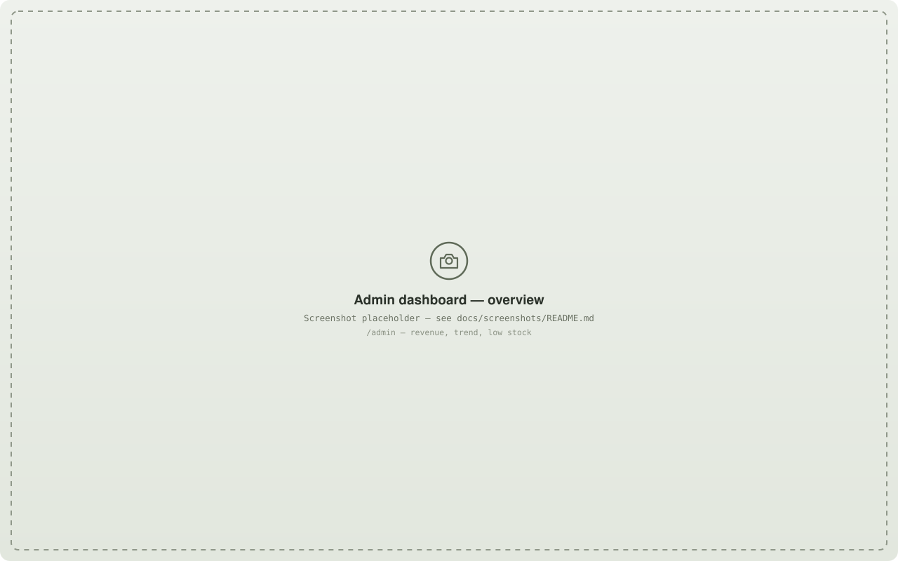
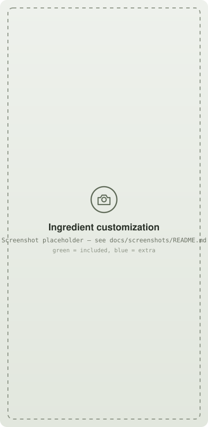
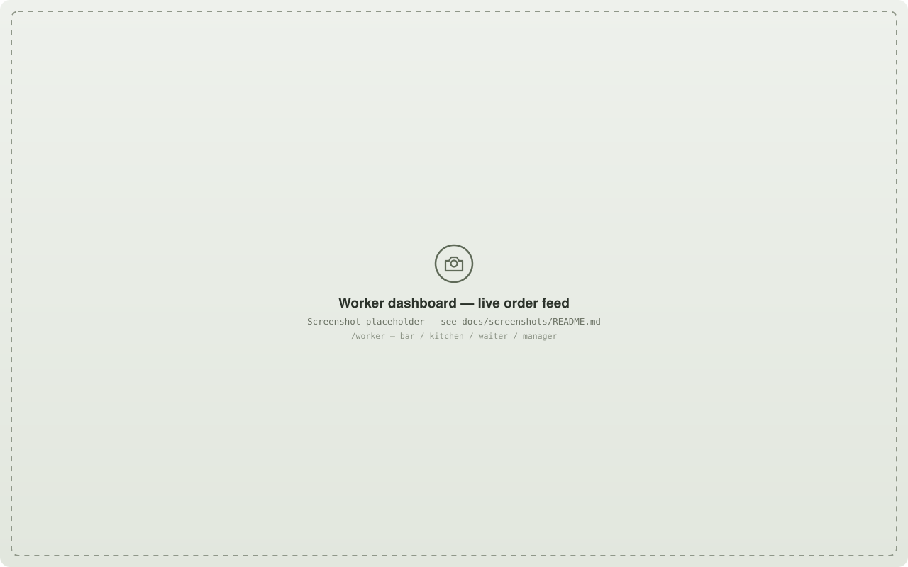
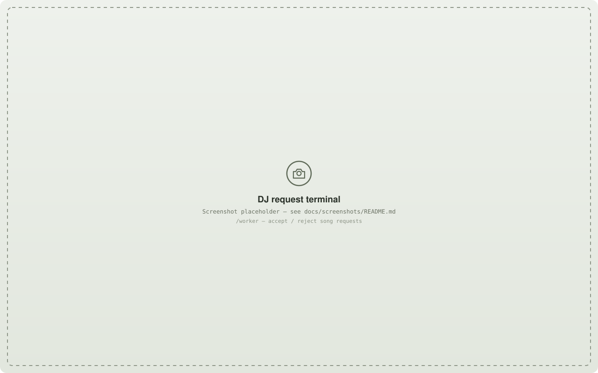
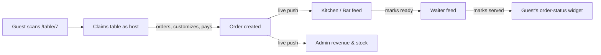
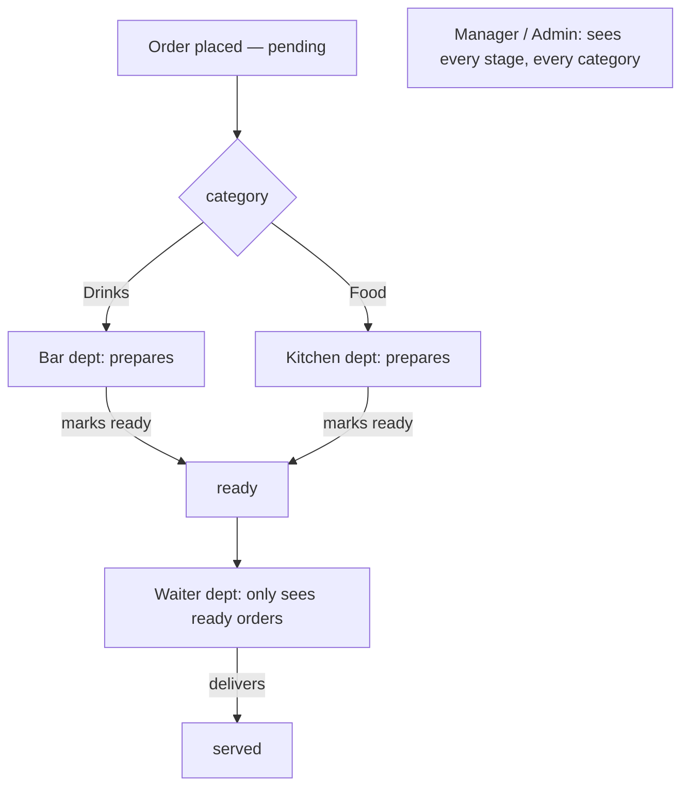

# 🍽️ BiteBox

**Scan the table. Order the round. Nobody touches a POS terminal.**

BiteBox turns any restaurant or bar table into a live ordering hub: a guest scans a QR code, claims the table as its "host," orders off a menu that updates in real time, customizes items ingredient-by-ingredient, and even sends a paid song request to the DJ — while staff across five roles work the exact same orders live, with zero page refreshes anywhere in the app.

<p align="center">
  
  &nbsp;&nbsp;
  
</p>

<p align="center">
  
  
  
  
  
  
</p>

---

## Contents

- [Why BiteBox](#why-bitebox)
- [Feature tour](#feature-tour)
- [Tech stack](#tech-stack)
- [How it stays live](#how-it-stays-live)
- [Getting started](#getting-started)
- [Seed accounts](#seed-accounts)
- [Roles &amp; departments](#roles--departments)
- [Project structure](#project-structure)
- [Roadmap](#roadmap)
- [Known limitations](#known-limitations)
- [Security notes](#security-notes)
- [Contributing](#contributing)
- [License](#license)

## Why BiteBox

Most small-venue ordering software is either a heavyweight cloud POS with a monthly bill, or a one-off QR-menu PDF with no way to actually route an order anywhere. BiteBox sits in between: **one Go binary, one SQLite file, no external services** — it runs on a Raspberry Pi behind the bar as happily as it runs in the cloud, and every screen (guest or staff) updates itself live over a WebSocket the instant something changes elsewhere in the venue.

## Feature tour

### For guests

- **QR table sessions with single-host locking.** The first phone to open `/table/{n}` becomes that table's host and the only device allowed to order; every other phone that scans the same code gets a read-only "table is occupied" view. No double-ordering, no race between two people's phones.
- **Live menu, grouped by category.** Drinks / Food / Other tabs, with price, availability, and remaining stock all pushed live — an admin marking an item out of stock removes it from every open guest's screen instantly, no refresh.
- **Ingredient customization that actually reads clearly.** One panel per item shows both what can be **removed** (green by default, tap to exclude) and what can be **added extra** (blue by default, tap to include, turns green) — green always means "this is on my order," for either kind.

  <p align="center"></p>

- **Real stock, honestly reserved.** An item sitting in someone else's cart is unavailable to you the moment they add it — not just at checkout — so two tables can never both "win" the last plate.
- **Cash or card at checkout**, an optional note to the kitchen/bar, and a running "Your orders" history for the whole table visit.
- **Self-service cancel.** Cancel an unpaid order outright; an already-paid order instead flags a refund request for staff, since there's no payment gateway to reverse a charge through automatically.
- **Paid song requests to the DJ** — song, tip amount (with quick-tip chips or a custom amount), and a live accept/decline widget once the DJ responds. A venue that doesn't run a DJ can switch the whole feature off from the admin dashboard — guests simply never see the form.

### For staff

- **One dashboard, five roles.** The exact same worker dashboard template adapts to whoever's logged in: a **waiter** only sees orders the kitchen or bar have marked *ready* (the pop-up-to-deliver handoff); **bar** and **kitchen** each see only their own category's pending/preparing orders; a **manager** (superworker) sees everything, end to end; a **DJ** sees only the request terminal, no order feed at all.

  <p align="center"></p>

- **One tap through the order lifecycle** — pending → preparing → ready → served — with the next action always labeled for what it actually does ("Start preparing," "Mark ready," "Mark served"), plus a separate cancel path that restores reserved stock.
- **Mark paid / unpaid with a real undo**, not a client-side illusion — "Undo" on the toast is a genuine second request, so every other connected screen agrees with what actually happened.
- **DJ terminal** — accept or reject a request with one tap; the guest's table sees the decision the instant it happens.

  <p align="center"></p>

### For admins

- **Revenue overview with a real trend chart** — today / this week / this month, each updating live as orders come in and get paid, plus a week-over-week delta.
- **Low-stock alerts** that account for what's currently sitting in guests' carts, not just the raw inventory number.
- **Menu &amp; inventory management** — create/edit/hide products, set tracked or unlimited stock, and tag ingredients as removable or extra per item, all reflected on the live guest menu within moments.

  <p align="center"></p>

- **Table configuration** — add, remove, or force-release a table (e.g. a guest walked off without hitting "Leave"), with the table grid updating live for every admin watching.
- **Staff &amp; access control** — create an account for any role/department in one form, deactivate one and watch their open session get force-disconnected within seconds (not just blocked on next login), see who's "Active now" vs. offline.
- **Full order history with CSV export**, and a one-tap venue-wide toggle for whether the DJ song-request feature is even offered to guests.
- **Every panel is live.** Not one dashboard number, table card, or menu row in the admin view depends on a page refresh — each has its own WebSocket connection layered under the same server-rendered HTML.

## Tech stack

| Layer | Choice | Why |
|---|---|---|
| Language | [Go](https://go.dev/) 1.25 | Single static-ish binary, no runtime to install on the venue's machine. |
| Database | [SQLite](https://www.sqlite.org/) via `mattn/go-sqlite3`, WAL mode | Zero-ops embedded storage; WAL mode gives concurrent readers alongside the live-update writer load without lock contention. |
| Router | [`go-chi/chi`](https://github.com/go-chi/chi) | Minimal, idiomatic `net/http` routing — no framework magic. |
| Rendering | Server-side `html/template` | Every screen is rendered HTML; no client build step, no JS bundle. |
| Interactivity | [htmx 1.9.10](https://htmx.org/) + the official `ws` extension | Declarative `hx-post`/`hx-target` swaps for actions, and out-of-band WebSocket swaps for everything that needs to update live without the user doing anything. |
| WebSockets | [`gorilla/websocket`](https://github.com/gorilla/websocket) behind a small internal pub/sub hub | One topic per live-updating panel; broadcasts fan out to every subscriber without blocking on a slow client. |
| Auth | `golang.org/x/crypto/bcrypt` + server-side sessions | Guests and staff use two entirely separate session systems — see [How it stays live](#how-it-stays-live). |

## How it stays live

Every mutation in BiteBox follows the same shape: render the affected fragment once, send it back to whoever triggered the change over plain HTTP, and broadcast that same fragment to every other interested screen over its WebSocket topic as an out-of-band swap. A kitchen marking an order "ready" doesn't just update the kitchen's own screen — it simultaneously removes the order from the kitchen's feed, adds it to the waiter's feed, and updates the guest's own order-status widget at their table, all within the same round trip.



## Getting started

### Prerequisites

- **Go 1.21+** — [install instructions](https://go.dev/doc/install)
- **A C compiler** (gcc/clang) — required because `go-sqlite3` uses CGO. On Debian/Ubuntu: `sudo apt install build-essential`. On macOS, Xcode Command Line Tools cover this.

### Install &amp; run

```bash
git clone https://github.com/Kominipaul/GO.git bitebox
cd bitebox
go mod tidy
go run ./cmd/server
```

You should see:

```
⚡ [SQLite] Database initialized and seeded successfully
🚀 BiteBox Go server running on http://localhost:8080/table/1
```

On first launch, BiteBox creates `bitebox.db`, seeds a small sample menu (Drinks + Food), and creates one staff account per department — see [Seed accounts](#seed-accounts) below.

| What | URL |
|---|---|
| Scan a table (becomes host on first visit) | `http://localhost:8080/table/1` |
| Staff / admin login | `http://localhost:8080/login` |
| Admin dashboard | `http://localhost:8080/admin` |
| Worker dashboard | `http://localhost:8080/worker` |

Open `/table/1` in one browser and in a private/incognito window to see the host-lock behavior — the second "device" gets the read-only guest view instead of stealing the ordering session.

### Resetting the database

Resets are manual and explicit — nothing wipes data automatically on startup or restart.

```bash
scripts/reset-db.sh     # deletes bitebox.db* and rebuilds a clean, freshly-seeded copy
go run ./cmd/resetdb    # re-runs migrations/seeding against whatever bitebox.db already exists, without deleting it
```

### Building a binary

```bash
go build -o bitebox ./cmd/server
./bitebox
```

## Seed accounts

One working login per department, so every role is testable out of the box:

| Username | Password | Role | Department | Sees |
|---|---|---|---|---|
| `admin` | `admin123` | Admin | — | Everything — bypasses every department restriction. |
| `manager` | `manager123` | Worker | Superworker | Every order, every status — the "sees everything" worker account. |
| `waiter` | `waiter123` | Worker | Waiter | Only orders the kitchen/bar have marked **ready**. |
| `bar` | `bar123` | Worker | Bar | Pending/preparing **Drinks** orders only. |
| `kitchen` | `kitchen123` | Worker | Kitchen | Pending/preparing **Food** orders only. |
| `dj` | `dj123` | Worker | DJ | The song-request terminal only — no order feed. |

> **Change these before any real deployment.** They're intentionally simple, fixed, well-known credentials meant for local development and demos — see [Security notes](#security-notes).

## Roles &amp; departments



Admin accounts bypass department checks entirely — they're not "in" a department, they can reach every worker view. A worker account's department is a genuine access boundary enforced on the server (`RequireDepartment` middleware), not just a UI filter.

## Project structure

```
bitebox/
├── go.mod / go.sum
├── bitebox.db                 # SQLite database (created on first run)
├── cmd/
│   ├── server/main.go         # entry point — router, middleware, every route
│   └── resetdb/main.go        # migrate + seed only, no server
├── internal/
│   ├── models/                # shared structs & enums (Order, Product, User, statuses, departments...)
│   ├── auth/                  # bcrypt hashing, session-ID generation, the staff auth cookie
│   ├── cart/                  # in-memory, session-keyed pre-checkout cart
│   ├── wshub/                 # tiny generic topic pub/sub hub for live pushes
│   ├── db/                    # every SQL statement — one file per entity
│   │   ├── db.go              # connection, schema, migrations, users/sessions
│   │   ├── products.go · ingredients.go · tables.go
│   │   ├── orders.go · songs.go · settings.go
│   └── handlers/               # every HTTP handler + WebSocket endpoint
│       ├── middleware.go       # RequireRole / RequireDepartment
│       ├── auth.go · table.go · cart.go · guest_orders.go · dj.go
│       ├── menu.go · ws.go     # live-menu rendering + all WebSocket upgrade endpoints
│       ├── admin.go · staff.go · stats.go · worker.go
├── templates/                  # server-rendered html/template files
│   ├── host_menu.html · guest_menu.html · table_left.html · login.html
│   ├── admin_dashboard.html · worker_dashboard.html
│   └── _*.html                 # fragments reused by both plain HTTP responses and WebSocket OOB pushes
├── scripts/reset-db.sh
├── docs/screenshots/            # images used in this README
└── TODO.md                      # living log of what's built, rough edges, and what's next
```

## Roadmap

- [x] **Authentication &amp; RBAC** — bcrypt-hashed logins, server-side sessions, role- and department-scoped routes
- [x] **Admin dashboard** — menu/inventory management, table configuration, staff management, revenue analytics
- [x] **Worker dashboard** — live order feed over WebSockets, full order lifecycle, DJ request terminal
- [x] **Live updates everywhere** — WebSocket push replaced every polling loop in the app
- [x] **Ingredient customization** — removable + extra ingredients, admin-managed, guest-facing
- [x] **Order cancellation &amp; refund requests** — guest self-service and staff-side
- [ ] **Payments** — no real payment gateway yet; "card" at checkout is a demo that marks the order paid instantly. Stripe/Viva Wallet-style integration for Apple Pay/Google Pay/card is still open.
- [ ] **Automated tests** — none yet, anywhere in the codebase.

See `TODO.md` for the full, actively-maintained log — it's more current than this section will stay.

## Known limitations

- **No real payment processing.** Card checkout is a UI-labeled demo; only cash is a genuine "collect in person" flow.
- **Seeded passwords are fixed and public in this README** — fine for local dev/demos, must be changed before touching a real venue's network. There's no forced-change or self-service reset flow yet.
- **`bitebox.db` is committed to the repository** for demo convenience. In a real deployment, gitignore it and rely on `scripts/reset-db.sh` / first-run seeding instead.
- **No automated tests, no graceful shutdown, no cart-reservation expiry timer** — a guest who abandons a table without hitting "Leave" keeps their cart's stock reserved until an admin force-releases the table.

The full, unfiltered list — including intentional design tradeoffs versus genuine gaps — lives in `TODO.md`.

## Security notes

- Passwords are hashed with bcrypt — never stored or logged in plaintext.
- Staff auth sessions are opaque server-side tokens stored in SQLite (`auth_sessions`), separate from the anonymous guest table-host session, so logout, expiry (24h), and deactivation are enforced on the server rather than trusted to the client — deactivating an account force-closes any WebSocket connection it currently has open within seconds.
- No client-supplied identifier is trusted for authorization: which table a guest can order onto, and which ingredients they can exclude/add, are always re-derived or validated server-side, never taken at face value from a form field.
- The seeded accounts documented above use fixed, publicly-known passwords by design, for local development and demos — treat them as compromised from the moment this repository is cloned, and replace every one of them before any real-world use.

## Contributing

Issues and PRs are welcome. Please open an issue describing the change before submitting larger PRs so we can align on approach.

## License

[MIT](LICENSE)
